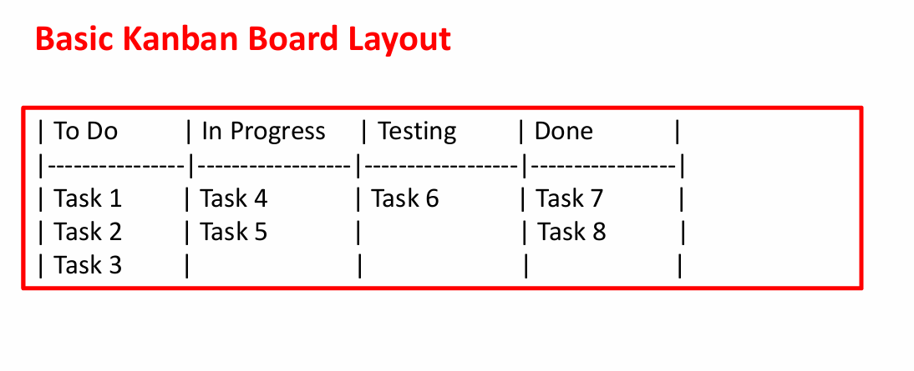
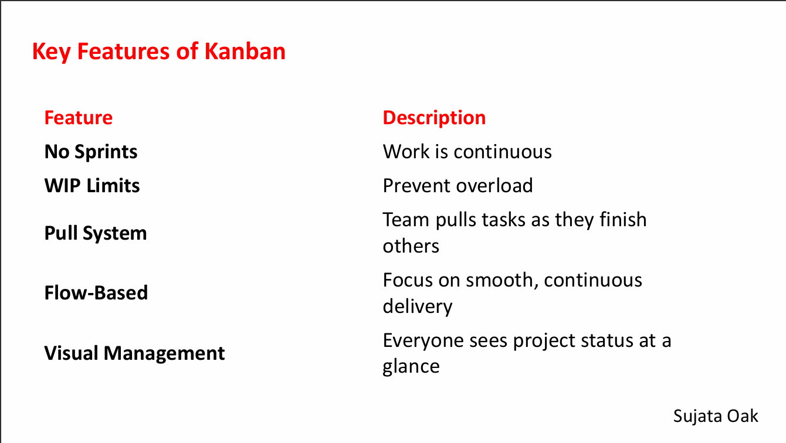

**What is Agility?**

Agility in software engineering refers to the ability of a development team to rapidly and effectively respond to changes—whether they are in requirements, technology, or market conditions.

**✔ Key Points (Easy Definition)**

Agility means:

- Delivering software quickly and continuously
- Accepting and adapting to changing requirements
- Working in small, manageable increments
- Maintaining close communication with customers
- Emphasizing simplicity, quality, and continuous improvement

**✔ Characteristics of Agility**

- Customer satisfaction via rapid delivery
- Welcomes changing requirements at any stage
- Frequent delivery of working software
- Collaboration between developers and customers
- Self-organizing teams
- Continuous feedback and improvement (retrospectives)

**Kanban Model**

- **Kanban**: Is an Agile project management method used to visualize workflow, limit work in progress (WIP), and optimize efficiency.
- Unlike Scrum, Kanban doesn’t use time-boxed sprints; instead, it focuses on continuous delivery.

**What is Kanban?**

- Originated from Toyota's manufacturing system.
- Means “visual card” in Japanese.
- Helps teams see the flow of tasks and manage them effectively.

**Core Principles of Kanban**:

1.  **Visualize the workflow**: Use a board with columns (To Do, In Progress, Done).
2.  **Limit Work in Progress (WIP)**: Prevent overloading by limiting tasks in each stage.
3.  **Manage Flow**: Track how work moves through the system.
4.  **Make Process Policies Explicit**: Everyone should understand how tasks flow.
5.  **Improve Collaboratively**: Optimize the system continuously.

**Benefits of Kanban**:

- Simple to implement
- Improves transparency
- Better resource utilization
- Quickly adapts to change
- Ideal for maintenance and support teams

**Disadvantage of Kanban**:

1.  Lacks structured planning.
2.  No time-boxing → less predictability.
3.  May lead to slower delivery if not managed properly.

**When to Use Kanban?**

- Ongoing projects or support/maintenance work.
- Teams needing flexibility and continuous delivery.
- Projects where priorities shift frequently.
