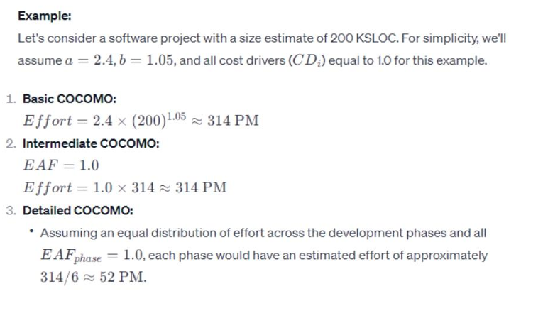

**The Constructive Cost Model (COCOMO)**: Is an algorithmic software cost estimation model developed by Barry Boehm. The model uses a basic regression formula, with parameters that are derived from historical project data and current project characteristics. COCOMO was first published in 1981 Barry W.

References to this model typically call it **COCOMO 81**. In 1997 **COCOMO II** was developed and finally published in 2000 in the book Software Cost Estimation with COCOMO II. COCOMO II is the successor of COCOMO 81 and is better suited for estimating modern software development projects. It provides more support for modern software development processes and an updated project database.

**COCOMO II**: Is tuned to modern software life cycles. The original COCOMO model has been very successful, but it doesn't apply to newer software development practices as well as it does to traditional practices. COCOMO II targets modern software projects, and will continue to evolve over the next few years.

**COCOMO II has three different models**:

a) **The Application Composition Model**:
Suitable for projects built with modern GUI-builder tools. Based on new Object Points.

b) **The Early Design Model**:
You can use this model to get rough estimates of a project's cost and duration before you've determined it's entire architecture. It uses a small set of new Cost Drivers, and new estimating equations. Based on Unadjusted Function Points or KSLOC.

c) **The Post-Architecture Model**:
This is the most detailed COCOMO II model. You'll use it after you've developed your project's overall architecture. It has new cost drivers, new line counting rules, and new equations.

**COCOMO II can be used for the following major decision situations**:

- Making investment or other financial decisions involving a software development effort.
- Setting project budgets and schedules as a basis for planning and control.
- Deciding on or negotiating tradeoffs among software cost, schedule, functionality, performance or quality factors.
- Making software cost and schedule risk management decisions.
- Deciding which parts of a software system to develop, reuse, lease, or purchase.
- Making legacy software inventory decisions: what parts to modify, phase out, outsource, etc.
- Setting mixed investment strategies to improve organization's software capability, via reuse, tools, process maturity, outsourcing, etc.

