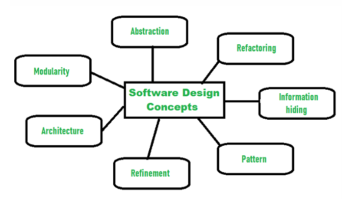

Concepts are defined as a principal idea or invention that comes into our mind or in thought to understand something. The software design concept simply means the idea or principle behind the design. It describes how you plan to solve the problem of designing software, the logic, or thinking behind how you will design software. It allows the software engineer to create the model of the system or software or product that is to be developed or built. The software design concept provides a supporting and essential structure or model for developing the right software.

The set of fundamental software design concepts are as follows:

1.  **Abstraction**:

    - A solution is stated in large terms using the language of the problem environment at the highest level abstraction.
    - The lower level of abstraction provides a more detail description of the solution.
    - A sequence of instruction that contain a specific and limited function refers in a procedural abstraction.
    - A collection of data that describes a data object is a data abstraction.

2.  **Architecture**:

    - The complete structure of the software is known as software architecture.
    - Structure provides conceptual integrity for a system in a number of ways.
    - The architecture is the structure of program modules where they interact with each other in a specialized way.
    - The components use the structure of data.
    - The aim of the software design is to obtain an architectural framework of a system.
    - The more detailed design activities are conducted from the framework.

3.  **Patterns**:

    - A design pattern describes a design structure and that structure solves a particular design problem in a specified content.

4.  **Modularity**:

    - A software is separately divided into name and addressable components. Sometime they are called as modules which integrate to satisfy the problem requirements.
    - Modularity is the single attribute of a software that permits a program to be managed easily.

5.  **Information hiding**:

    - Modules must be specified and designed so that the information like algorithm and data presented in a module is not accessible for other modules not requiring that information.

6.  **Functional independence**:

    - The functional independence is the concept of separation and related to the concept of modularity, abstraction and information hiding.
    - The functional independence is accessed using two criteria i.e Cohesion and coupling.
    - **Cohesion**:
      - Cohesion is an extension of the information hiding concept.
      - A cohesive module performs a single task and it requires a small interaction with the other components in other parts of the program.
    - **Coupling**:
      - Coupling is an indication of interconnection between modules in a structure of software.

7.  **Refinement**:

    - Refinement is a top-down design approach.
    - It is a process of elaboration.
    - A program is established for refining levels of procedural details.
    - A hierarchy is established by decomposing a statement of function in a stepwise manner till the programming language statement are reached.

8.  **Refactoring**:

    - It is a reorganization technique which simplifies the design of components without changing its function behaviour.
    - Refactoring is the process of changing the software system in a way that it does not change the external behaviour of the code still improves its internal structure.

9.  **Design classes**:
    - The model of software is defined as a set of design classes.
    - Every class describes the elements of problem domain and that focus on features of the problem which are user visible.
