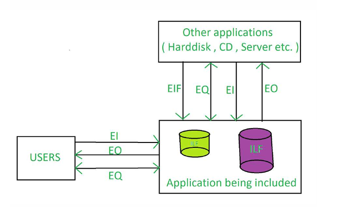
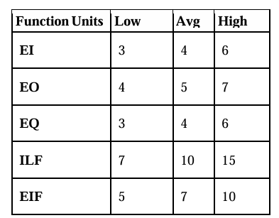

**Function Point Analysis (FPA)**: Is a method or set of rules of Functional Size Measurement. It assesses the functionality delivered to its users, based on the user’s external view of the functional requirements. It measures the logical view of an application, not the physically implemented view or the internal technical view.

The **Function Point Analysis** technique is used to analyze the functionality delivered by software and **Unadjusted Function Point (UFP)** is the unit of measurement.

**Objectives of FPA**:

- The objective of FPA is to measure the functionality that the user requests and receives.
- The objective of FPA is to measure software development and maintenance independently of the technology used for implementation.
- It should be simple enough to minimize the overhead of the measurement process.
- It should be a consistent measure among various projects and organizations.

**Types of FPA**:

- **Transactional Functional Type**:
  - **External Input (EI)**: EI processes data or control information that comes from outside the application’s boundary. The EI is an elementary process.
  - **External Output (EO)**: EO is an elementary process that generates data or control information sent outside the application’s boundary.
  - **External Inquiries (EQ)**: EQ is an elementary process made up of an input-output combination that results in data retrieval.
- **Data Functional Type**:
  - **Internal Logical File (ILF)**: A user identifiable group of logically related data or control information maintained within the boundary of the application.
  - **External Interface File (EIF)**: A group of users recognizable logically related data allusion to the software but maintained within the boundary of another software.

**Benefits of FPA**:

- FPA is a tool to determine the size of a purchased application package by counting all the functions included in the package.
- It is a tool to help users discover the benefit of an application package to their organization by counting functions that specifically match their requirements.
- It is a tool to measure the units of a software product to support quality and productivity analysis.
- It is a vehicle to estimate the cost and resources required for software development and maintenance.
- It is a normalization factor for software comparison.

**The drawback of FPA**:

- It requires a subjective evaluation and involves many judgements.
- Many cost and effort models are based on LOC, so it is necessary to change the function points.
- Compared to LOC, there are less research data on function points.
- Run after creating the design spec.
- With subjective judgement, the accuracy rate of the assessment is low.
- Due to the long learning curve, it is not easy to gain proficiency.
- This is a very time-consuming method.

**Calculation of Function Point (FP)**

**Function Point (FP)**: Is an element of software development which helps to approximate the cost of development early in the process. It may measures functionality from user’s point of view.

**Counting Function Point (FP)**:

- **Step-1**:
  `F = 14 * scale`
  Scale varies from 0 to 5 according to character of **Complexity Adjustment Factor (CAF)**. Below table shows scale:
  - 0 - No Influence
  - 1 - Incidental
  - 2 - Moderate
  - 3 - Average
  - 4 - Significant
  - 5 - Essential
- **Step-2**: Calculate **Complexity Adjustment Factor (CAF)**.
  `CAF = 0.65 + ( 0.01 * F )`
- **Step-3**: Calculate **Unadjusted Function Point (UFP)**.
  TABLE (Required)

  

  Multiply each individual function point to corresponding values in TABLE.

- **Step-4**: Calculate **Function Point**.
  `FP = UFP * CAF`

**Example**:

Given the following values, compute function point when all complexity adjustment factor (CAF) and weighting factors are average.

- User Input = 50
- User Output = 40
- User Inquiries = 35
- User Files = 6
- External Interface = 4

**Explanation**:

- **Step-1**: As complexity adjustment factor is average (given in question), hence,
  • scale = 3.
  F = 14 \_ 3 = 42  
  • Step-2:
  CAF = 0.65 + ( 0.01 * 42 ) = 1.07  
  • Step-3: As weighting factors are also average (given in question)
  hence we will multiply each individual function point to
  corresponding values in TABLE.
  UFP = (50*4) + (40*5) + (35*4) + (6*10) + (4*7) = 628  
  • Step-4:
  Function Point = 628 \* 1.07 = 671.96
