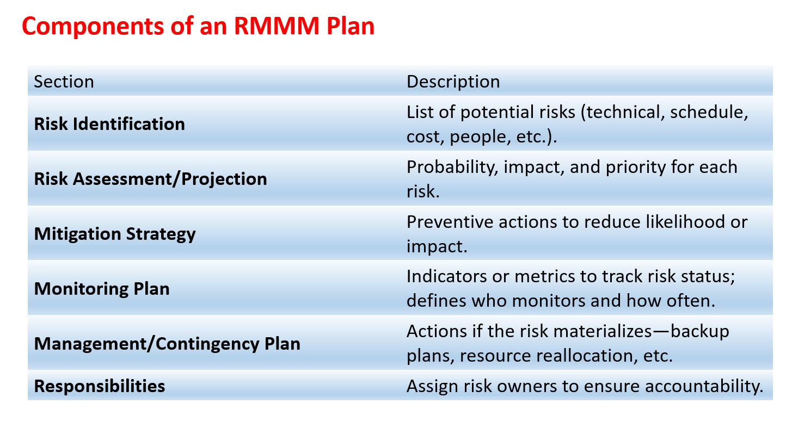

All of the risk analysis activities presented to this point have a single goal—to assist the project team in developing a strategy for dealing with risk. An effective strategy must consider three issues: **risk avoidance**, **risk monitoring**, and **risk management and contingency planning**.

- If a software team adopts a proactive approach to risk, **avoidance** is always the best strategy. This is achieved by developing a plan for risk mitigation. For example, assume that high staff turnover is noted as a project risk r1. Based on past history and management intuition, the likelihood of high turnover is estimated to be 0.70 (70 percent, rather high) and the impact x1 is projected as critical. That is, high turnover will have a critical impact on project cost and schedule. To mitigate this risk, you would develop a strategy for reducing turnover.

  Among the possible steps to be taken are:

  - Meet with current staff to determine causes for turnover (e.g., poor working conditions, low pay, competitive job market).
  - Mitigate those causes that are under your control before the project starts.
  - Once the project commences, assume turnover will occur and develop techniques to ensure continuity when people leave.
  - Organize project teams so that information about each development activity is widely dispersed.
  - Define work product standards and establish mechanisms to be sure that all models and documents are developed in a timely manner.
  - Conduct peer reviews of all work (so that more than one person is “up to speed”).
  - Assign a backup staff member for every critical technologist.

- As the project proceeds, **risk-monitoring** activities commence.

  - The project manager monitors factors that may provide an indication of whether the risk is becoming more or less likely.
  - In the case of high staff turnover, the general attitude of team members based on project pressures, the degree to which the team has jelled, interpersonal relationships among team members, potential problems with compensation and benefits, and the availability of jobs within the company and outside it are all monitored.
  - In addition to monitoring these factors, a project manager should monitor the effectiveness of risk mitigation steps.
  - For example, a risk mitigation step noted here called for the definition of work product standards and mechanisms to be sure that work products are developed in a timely manner.

- **Risk management and contingency planning** assumes that mitigation efforts have failed and that the risk has become a reality. Continuing the example, the project is well under way and a number of people announce that they will be leaving.

  - If the mitigation strategy has been followed, backup is available, information is documented, and knowledge has been dispersed across the team.
  - In addition, you can temporarily refocus resources (and readjust the project schedule) to those functions that are fully staffed, enabling newcomers who must be added to the team to “get up to speed.”
  - Those individuals who are leaving are asked to stop all work and spend their last weeks in “knowledge transfer mode.”

