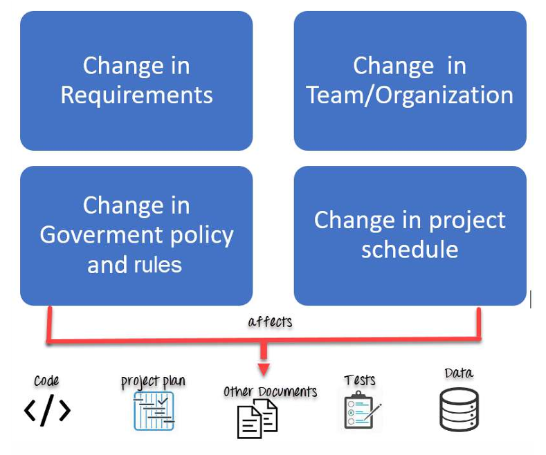

**Software Configuration Management (SCM)**: Is a process to systematically manage, organize, and control the changes in the documents, codes, and other entities during the Software Development Life Cycle. The primary goal is to increase productivity with minimal mistakes.

**The primary reasons for Implementing Technical Software Configuration Management System are**:

- There are multiple people working on software which is continually updating.
- It may be a case where multiple version, branches, authors are involved in a software config project, and the team is geographically distributed and works concurrently.
- Changes in user requirement, policy, budget, schedule need to be accommodated.
- Software should able to run on various machines and Operating Systems.
- Helps to develop coordination among stakeholders.
- SCM process is also beneficial to control the costs involved in making changes to a system.

Any change in the software configuration Items will affect the final product. Therefore, changes to configuration items need to be controlled and managed.

## SCM Repositories – Explained Simply

**SCM** stands for **Software Configuration Management**. An **SCM repository** is a storage location where all versions of your project’s files and documents are kept, tracked, and managed.

Think of it like a time-machine + organizer for your code.

---

## ✅ **What is an SCM Repository?**

An **SCM repository** is a central place where:

- Your **source code** is stored
- Every **change** is recorded
- Multiple developers can **collaborate**
- You can **revert** to previous versions
- Different versions (branches) can be created

It ensures your project does not get messed up even when many people work on it.

---

## 🔧 Examples of SCM Tools (Version Control Systems)

These tools provide SCM repositories:

- **Git** → GitHub, GitLab, Bitbucket
- **SVN** (Subversion)
- **Mercurial**
- **Perforce**
- **CVS**

---

## 🧱 Types of SCM Repositories

### **1. Local Repository**

- Stored on your personal machine
- You commit changes locally
- Example: Git repository in your project folder

### **2. Central Repository**

- Stored on a remote server
- Team members push/pull changes
- Example: GitHub repo, GitLab remote repo

### **3. Distributed Repository**

- Every developer has a full copy of the repo
- Common in Git

---

## 🎯 Key Features of an SCM Repository

### **1. Version Control**

Maintains history of all changes.
You can go back to any earlier version anytime.

### **2. Branching & Merging**

- **Branching:** Create separate workspaces (e.g., new features)
- **Merging:** Combine changes back to main code

### **3. Collaboration**

Multiple developers can work together without conflicts.

### **4. Change Tracking**

Every change is tagged with:

- Who made it
- What was changed
- When it was changed
- Why it was changed

### **5. Backup & Recovery**

Provides safety against accidental deletion or code loss.

---

## 🧪 Why SCM Repositories are Important?

| Benefit                | Description                       |
| ---------------------- | --------------------------------- |
| **Control changes**    | Prevents accidental overwriting   |
| **Team collaboration** | Multiple developers work smoothly |
| **Avoids duplication** | Single source of truth            |
| **Traceability**       | Track bugs and fixes              |
| **Automation**         | Integrates with CI/CD pipelines   |

---

## 🌐 Real-World Example

Suppose you are building a website.

- You upload the project on **GitHub**
- Your teammates clone it
- Everyone works on their own branch
- Changes are reviewed via pull requests
- Finally merged into the main branch

GitHub is acting as your **SCM repository**.

---

## 📝 Summary

An **SCM repository** is the backbone of modern software development.
It stores your code, tracks every version, enables teamwork, prevents mistakes, and ensures quality through controlled changes.

---
