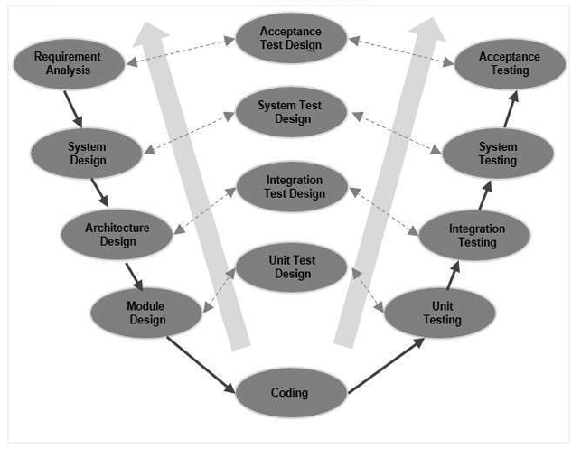

**V-Model**

A variation in the representation of the waterfall model is called the **V-model**. The V-model [Buc99] depicts the relationship of quality assurance actions to the actions associated with communication, modeling, and early construction activities. It is also referred to as the **Verification and Validation Model**. In this, each phase of SDLC must complete before the next phase starts. It follows a sequential design process same as the waterfall model. Testing of the device is planned in parallel with a corresponding stage of development. As a software team moves down the left side of the V, basic problem requirements are refined into progressively more detailed and technical representations of the problem and its solution. Once code has been generated, the team moves up the right side of the V, essentially performing a series of tests (quality assurance actions) that validate each of the models created as the team moved down the left side. In reality, there is no fundamental difference between the classic life cycle and the V-model. The V-model provides a way of visualizing how verification and validation actions are applied to earlier engineering work.

**Verification**: It involves a static analysis method (review) done without executing code. It is the process of evaluation of the product development process to find whether specified requirements meet.

**Validation**: It involves dynamic analysis method (functional, non-functional), testing is done by executing code. Validation is the process to classify the software after the completion of the development process to determine whether the software meets the customer expectations and requirements.

So, V-Model contains Verification phases on one side of the Validation phases on the other side. Verification and Validation process is joined by coding phase in V-shape. Thus, it is known as V-Model.

**There are the various phases of Verification Phase of V-model**:

1.  **Business requirement analysis**: This is the first step where product requirements understood from the customer's side. This phase contains detailed communication to understand customer's expectations and exact requirements. The acceptance test design planning is done at this stage as business requirements can be used as an input for acceptance testing.
2.  **System Design**: Once you have the clear and detailed product requirements, it is time to design the complete system. The system design will have the understanding and detailing the complete hardware and communication setup for the product under development. The system test plan is developed based on the system design. Doing this at an earlier stage leaves more time for the actual test execution later.
3.  **Architecture Design**: The baseline in selecting the architecture is that it should understand all which typically consists of the list of modules, brief functionality of each module, their interface relationships, dependencies, database tables, architecture diagrams, technology detail, etc. The integration testing model is carried out in a particular phase.
4.  **Module Design**: In the module design phase, the system breaks down into small modules. The detailed design of the modules is specified, which is known as Low-Level Design. t is important that the design is compatible with the other modules in the system architecture and the other external systems. The unit tests are an essential part of any development process and helps eliminate the maximum faults and errors at a very early stage. These unit tests can be designed at this stage based on the internal module designs.
5.  **Coding Phase**: After designing, the coding phase is started. Based on the requirements, a suitable programming language is decided. There are some guidelines and standards for coding. Before checking in the repository, the final build is optimized for better performance, and the code goes through many code reviews to check the performance.

**There are the various phases of Validation Phase of V-model**:

1.  **Unit Testing**: In the V-Model, Unit Test Plans (UTPs) are developed during the module design phase. These UTPs are executed to eliminate errors at code level or unit level. A unit is the smallest entity which can independently exist, e.g., a program module. Unit testing verifies that the smallest entity can function correctly when isolated from the rest of the codes/ units.
2.  **Integration Testing**: Integration Test Plans are developed during the Architectural Design Phase. These tests verify that groups created and tested independently can coexist and communicate among themselves.
3.  **System Testing**: System Tests Plans are developed during System Design Phase. Unlike Unit and Integration Test Plans, System Tests Plans are composed by the client’s business team. System Test ensures that expectations from an application developer are met.
4.  **Acceptance Testing**: Acceptance testing is related to the business requirement analysis part. It includes testing the software product in user atmosphere. Acceptance tests reveal the compatibility problems with the different systems, which is available within the user atmosphere. It conjointly discovers the non-functional problems like load and performance defects within the real user atmosphere.

**When to use V-Model?**

- When the requirement is well defined and not ambiguous.
- The V-shaped model should be used for small to medium-sized projects where requirements are clearly defined and fixed.
- The V-shaped model should be chosen when sample technical resources are available with essential technical expertise.

**Advantage (Pros) of V-Model**:

- Easy to Understand.
- Testing Methods like planning, test designing happens well before coding.
- This saves a lot of time. Hence a higher chance of success over the waterfall model.
- Avoids the downward flow of the defects.
- Works well for small plans where requirements are easily understood.

**Disadvantage (Cons) of V-Model**:

- Very rigid and least flexible.
- Not a good for a complex project.
- Software is developed during the implementation stage, so no early prototypes of the software are produced.
- If any changes happen in the midway, then the test documents along with the required documents, has to be updated.

